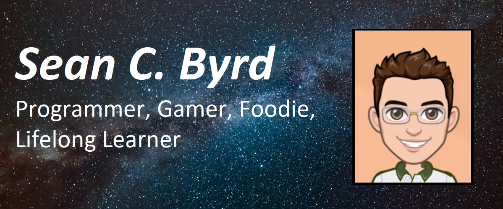

# Hello World, I'm Sean!! 🌎 👋

I'm web developer and overall programmer that strives to create amazing, reusable and scalable code. I had a love and interest in coding ever since I was a child, seeing a family member use a chat window to talk to someone in another country and wondering how it was possible. That curiousity led to a life of programming, and I love every minute of it!

Technologies I've used include: C#, ASP .Net, HTML5, SASS/CSS, Javascript, Typescript, JQuery, Bootstrap, Lucene, T-SQL

<!--
**byrdsean/byrdsean** is a ✨ _special_ ✨ repository because its `README.md` (this file) appears on your GitHub profile.

Here are some ideas to get you started:

- 🔭 I’m currently working on ...
- 🌱 I’m currently learning ...
- 👯 I’m looking to collaborate on ...
- 🤔 I’m looking for help with ...
- 💬 Ask me about ...
- 📫 How to reach me: ...
- 😄 Pronouns: ...
- ⚡ Fun fact: ...
-->
